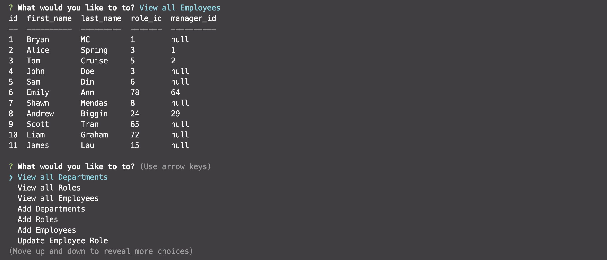

[](https://opensource.org/licenses/MIT)

## Description

This app runs through the command-line that allows user to interact with a company database. This app uses node packages inquirer, console.table, dotenv, mysql and util. Run npm install for all required node dependencies.

## Table of Contents

- [Description](#description)
- [Installation](#installation)
- [Usage](#usage)
- [Screenshot](#screenshot)
- [Demo-Video](#demo-video)
- [Contact](#contact)

## Installation

```md
Run (npm install)
```

## Usage

```md
Run (npm start)
```

# Screenshot



## Demo-Video

[Click Here!](https://drive.google.com/file/d/1YslTKydochuel27eJJUOpAaTBkohwKnI/view?usp=sharing)

## Contact

Email: vancungthawng@outlook.com

Github: [Click Here!](https://github.com/vanjungthawng)
